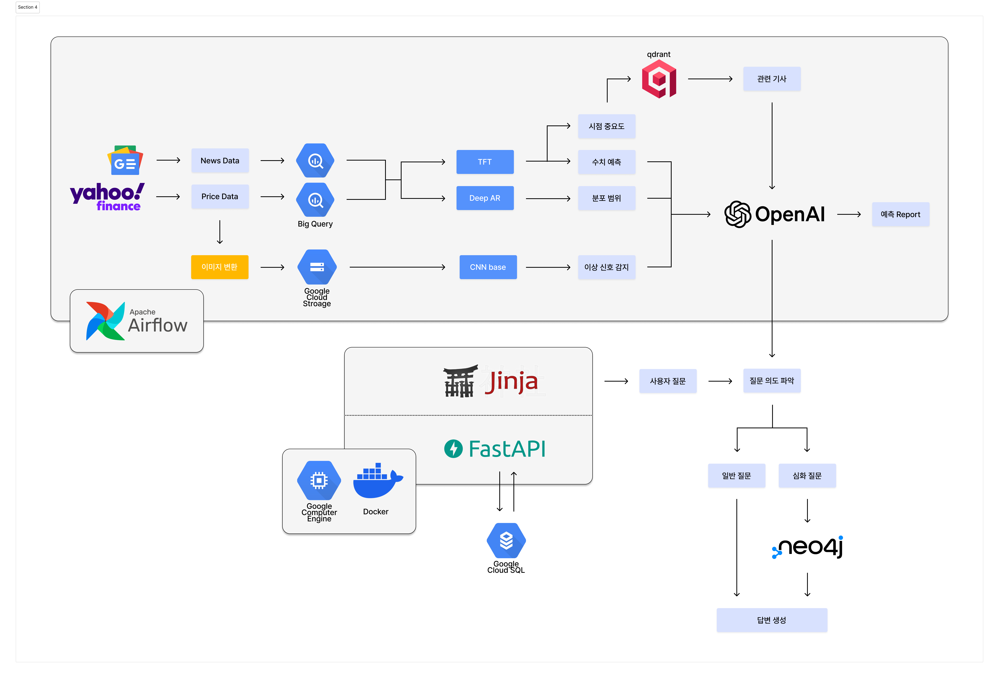

# 프로젝트 소개

### **문제 정의**

- **기존 시계열 예측의 한계**
    - 대부분의 예측 서비스는 **단일 모델을 통해 오를지 내릴지에 대한 수치 하나**만을 제공합니다.
    - 예측의 성패와 관계없이 **그 이유나 잠재적 리스크를 파악하기 어렵다**는 단점이 있습니다.
    - 결국 핵심 문제는 단순한 정확도가 아니라, **판단 근거와 불확실성에 대한 정보가 부재**하다는 점입니다.
- **수치 기반 모델의 구조적 문제**
    - 시계열 모델은 변동성이 급증하거나 레짐(Regime) 전환이 일어나는 구간에서 **예측 불확실성이 급격히 증가**합니다.
    - 하지만 사용자에게는 여전히 **단일 숫자만 제공**되기에, 현재 모델이 불안정해진 상태인지 인지할 수 없습니다.
- **비전 모델 도입의 이유**
    - 시계열 데이터에는 **단순한 값 외에도 특정한 패턴과 구조가 존재**합니다.
    - 특히 변동성이나 국면 전환은 숫자보다 **형태적 변화(Pattern)**로 더 직관적으로 드러납니다.
    - OHLC를 이용한 Candle이미지와 GAF(Gramian Angular Field)나 Recurrence Plot 등을 활용해 시계열을 이미지로 변환하면, **불확실한 구간을 시각적으로 표현**할 수 있습니다.
- **비전 모델의 역할**
    - 비전 모델은 가격 자체를 맞추기보다, 현재 시장이 안정적인지 혹은 전환 구간인지를 인식하는 도구로 활용됩니다.
    - 이를 통해  사용자의 **해석과 판단을 보조**합니다.

### 프로젝트 목표

- **판단 근거를 제공하는 시장 분석 서비스**
    - 선물 시장의 **향후 20일 가격 예측** 제공합니다.
    - 단순 예측을 넘어 **기사·시각적 데이터 기반으로 한 근거 리포트**를 **매일 사용자에게 제공**합니다.
    - 예측 결과 + 정성적·정량적 근거를 함께 제시하여 **의사 결정에 신뢰성과 맥락 제공**합니다.
- **타겟 사용자 : 개인 투자자**
    - 포트폴리오 다각화를 위해 **선물 및 원자재 ETF를 활용하는 개인 투자자**를 대상으로 합니다.
    - 단기 트레이딩보다는 **중·장기 추세에 기반한 자산 배분**에 관심을 둔 사용자에 초점을 맞춥니다.
    - "자산이 왜 움직이는가"에 대한 **경제적 해석과 가이드가 필요한 분**들에게 최적화된 정보를 제공합니다.

# 서비스 아키텍쳐

### 1. 데이터 수집 및 전처리 (Data Ingestion)

- **Source:** Google News와 Yahoo Finance로부터 뉴스 데이터와 가격 데이터를 수집합니다.
- **Process**
    - 가격 데이터: feature engineering 수행 및 차트 이미지 변환
    - 기사 데이터
        - 수집 후 Entity, Triple 관계 추출
        - 2stage Extraction 방식으로 저품질의 Triple과 Entity를 제거하며 이후 과정의 결과 품질을 보장하고자 합니다.    
- **Storage**
    - 뉴스 및 가격 데이터는 **BigQuery**에 저장되어 구조화된 분석을 준비합니다.
    - 이미지 변환 과정을 거친 데이터는 **Google Cloud Storage**에 비정형 데이터 형태로 저장됩니다.

### 2. AI 분석 및 예측 모델 (ML Pipeline) - window(5, 20, 60)으로 horizon 20까지 예측

- **TFT(Temporal Fusion Transformer**: 가격 데이터를 수치로 입력 받아 news feature를 512차원에서 48차원으로 축소 후 merge하여 multi-horizon forecast 학습합니다. 각 변수들의 중요도, 시점 중요도와 log_return_*, close_*가 output으로 저장됩니다.
- **DeepAR**: 가격 데이터를 수치로 입력 받아 multi-horizon forecast로 분포를 학습하고, q10-q90의 분포가 output으로 저장됩니다.     
- **CNN-based anomaly detection**: 차트 이미지를 입력으로 하여 news feature를 gated fusion합니다. 

### 3. 리포트 생성 및 LLM 연동 (OpenAI)

- TFT의 시점 중요도를 이용하여 **Qdrant** 기반 VectorRAG을 수행하여 도출한 기사와 분석된 결과물(수치, 분포, 이상 신호 등)과를 **OpenAI(LLM)**로 전달합니다.
- LLM은 이 복잡한 데이터들을 종합하여 사용자가 읽기 좋은 형태의 **'예측 리포트(Report)'**를 최종적으로 생성합니다.

### 4. 서비스 레이어 및 사용자 인터페이스 (Application Layer)

- **Backend:** **FastAPI**를 메인 프레임워크로 사용하며, **Jinja** 템플릿 엔진을 통해 프런트엔드(HTML)와 연동됩니다.
- **CI/CD:** **GitHub Actions**가 코드를 빌드·테스트하여 Docker 이미지를 생성하고, 이를 **Google Compute Engine(GCE)**에 자동 배포(CD)합니다.
- **Database:** 사용자 정보나 서비스 로그 등은 **Google Cloud SQL**에 저장됩니다.

### 5. 지능형 질의응답 시스템 (RAG & Knowledge Graph)

- **의도 파악:** 사용자의 질문이 들어오면 LLM를 통해 질문의 의도를 분석합니다.
- **분기 처리** Query Routing **:**
    - **일반 질문:** 바로 답변을 생성합니다.
    - **심화 질문:** **Neo4j**(Graph DB)를 조회하여 데이터 간의 복잡한 관계를 파악한 후 더 깊이 있는 답변을 생성합니다.
        - **Multi-hop Expansion** : 코사인 유사도와 거리 가중치를 결합
        - MMR 알고리즘, 발행일 가중치 반영
     

# 🎀 팀(부캠별의 커비) 소개

|  |  |  |  |
| :---: | :---: | :---: | :---: |
| **안태현** | **최정빈** | **이승현** | **윤종욱** |
| [@tenaan](https://github.com/tenaan) | [@jjeongbin0826](https://github.com/jjeongbin0826) | [@chocobanana20](https://github.com/chocobanana20) | [@wooqi00](https://github.com/wooqi00) |
